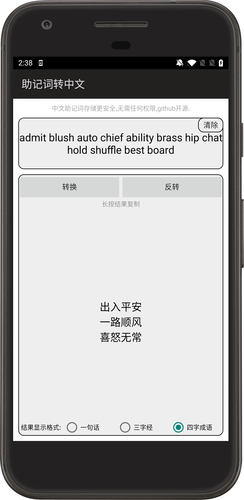
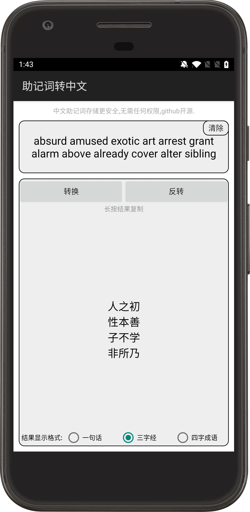
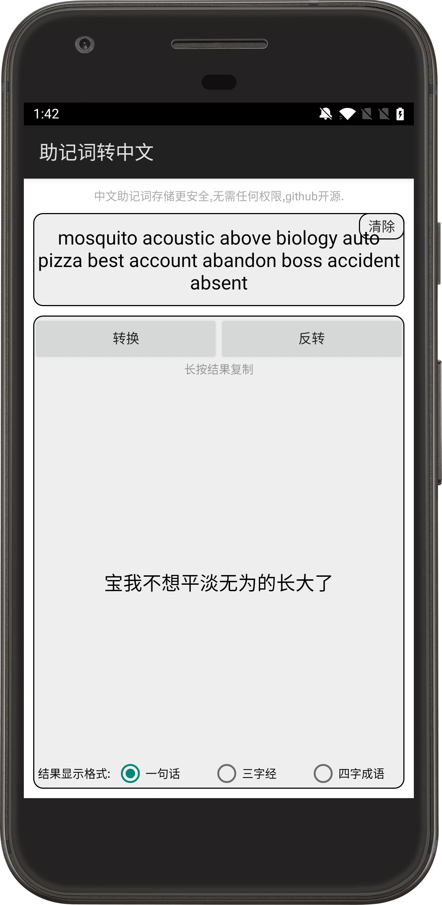
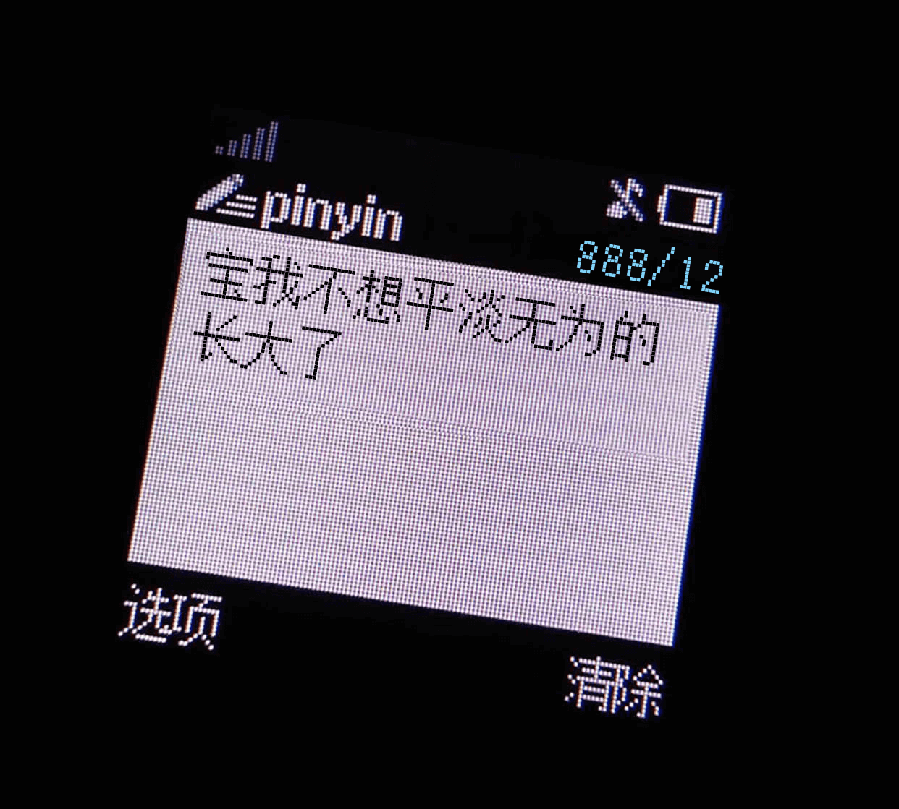
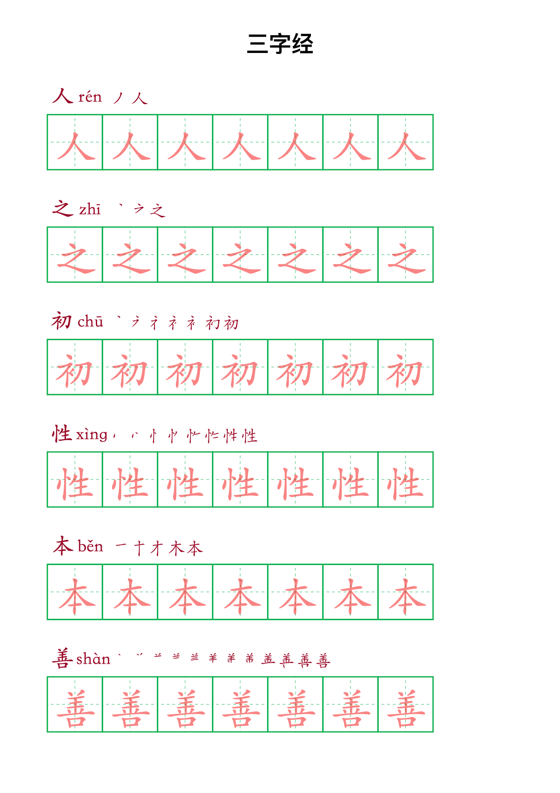

# [MnemonicToCN](https://github.com/wyjsonGo/MnemonicToCN)

[](https://github.com/wyjsonGo/GoRouter/blob/main/LICENSE)

助记词转中文,中文助记词传输、存储更安全,无需任何权限.支持各种位数(12、15、18、21、24)的助记词。

## 下载Apk


[MnemonicToCN_1.0.1.apk](https://github.com/wyjsonGo/MnemonicToCN/releases/download/1.0.1/MnemonicToCN_1.0.1.apk)

md5：bd71de4ba297f8c4f7740565a5685885

sha256：66128baaa02949639b77e0f0a9758ed8f2c09e128e5cc019c8c0199ab317f681

## 示例


可以想象你在网络上传输或存储英文助记词容易被第三方软件或后门程序检测盗取,或者助记词记录在纸张上被亲人或朋友盗取,丢失后也容易被他人认出这是助记词.

```
admit blush auto chief ability brass hip chat hold shuffle best board
转换后
出入平安一路顺风喜怒无常
```

而换成中文,不易被检测.它可以是一段话,三字经,四字成语格式存储,因为没有人知道它是助记词.

## 实现原理

根据
[bip39英文](https://github.com/bitcoin/bips/blob/master/bip-0039/english.txt)
对照表转换成
[bip39中文](https://github.com/bitcoin/bips/blob/master/bip-0039/chinese_simplified.txt)

## 关于存储
1.图片



2.转成字帖放在家里的书架上



3.制作成钥匙链放在抽屉里(我相信小偷会拿走钱也不会拿走你的钥匙链)


