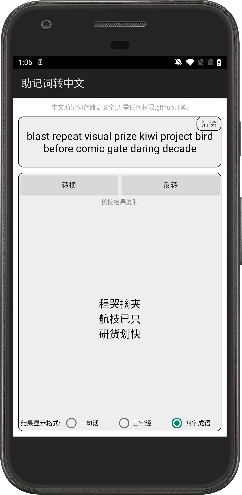
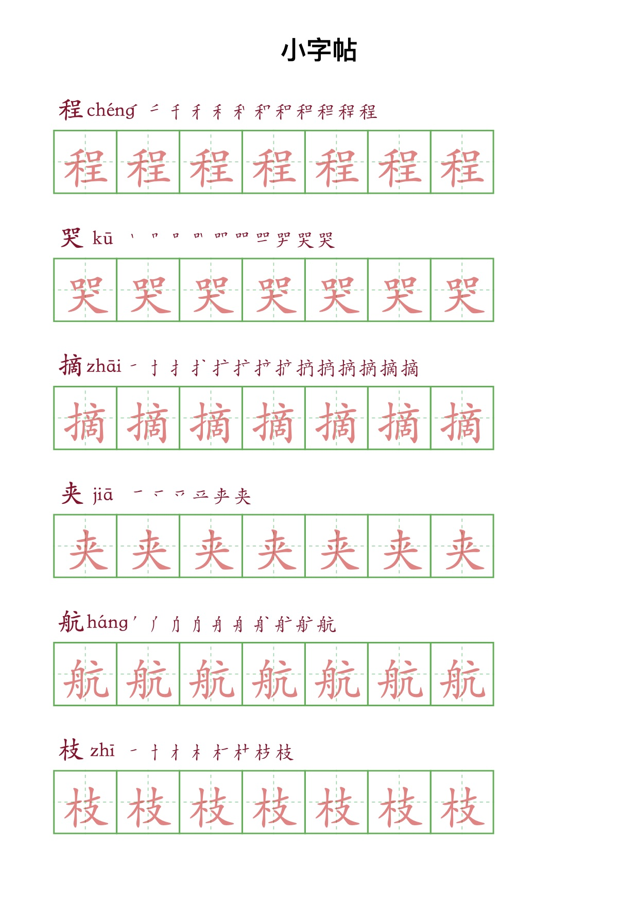

# MnemonicToCN
助记词转中文,中文助记词传输或存储更安全,无需任何权限.
(支持12、15、18、21位助记词)

## 实现原理

根据
[bip39英文](https://github.com/bitcoin/bips/blob/master/bip-0039/english.txt)
对照表转换成
[bip39中文](https://github.com/bitcoin/bips/blob/master/bip-0039/chinese_simplified.txt)

## 下载Apk


[MnemonicToCN_1.0.0.apk](https://github.com/wangyao5018/MnemonicToCN/releases/download/1.0.0/MnemonicToCN_1.0.0.apk)

md5:38e8d06c128c1a02f4cddf40b4c53311

sha256:7a3cedfc4fdbc7e2feff67e2855bf5e90f3398021d61a5e38127c6f036f87f7c

## 示例



可以想象你在网络上传输或存储英文助记词容易被第三方软件或后门程序检测盗取,或者助记词记录在纸张上丢失后也容易被他人认出这是助记词.

```
blast repeat visual prize kiwi project bird before comic gate daring decade
```

而换成中文,不易被检测.它可以是一段话,三字经,四字成语格式存储,因为没有人知道它是助记词.

```
一段话:程哭摘夹航枝已只研货划快

三字经:
	程哭摘
	夹航枝
	已只研
	货划快

四字成语:
	程哭摘夹
	航枝已只
	研货划快
```

## 关于存储
1.图片


2.转成字帖放在家里的书架上



3.制作成钥匙链放在保险箱里(我相信小偷会拿走钱也不会拿走你的钥匙链)


